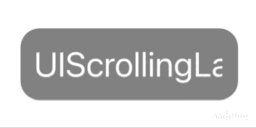

# UIScrollingLabel
Automatically Scrolled Label. 带跑马灯效果的 Label。

## Requirements

```
iOS 9.0+
```

## Installation

```
pod 'UIScrollingLabel'
```

```
UIScrollingLabel *label = [[UIScrollingLabel alloc] initWithMaxContentWidth:120 contentHeight:26 contentInset:UIEdgeInsetsMake(10, 10, 10, 10) textSpace:10 isAlwaysScrollEnable:YES];
label.backgroundColor = [UIColor colorWithWhite:0 alpha:0.5];
label.layer.cornerRadius = 12;
label.layer.masksToBounds = YES;
    
[self.view addSubview:label];
[label mas_makeConstraints:^(MASConstraintMaker *make) {
	make.center.equalTo(self.view);
}];
    
label.text = [[NSAttributedString alloc] initWithString:@"UIScrollingLabel" attributes:@{
	NSForegroundColorAttributeName: UIColor.whiteColor,
	NSFontAttributeName: [UIFont systemFontOfSize:22]
}];
```

## Author

S.T.A.R. sulioppa@icloud.com

## License

_UIScrollingLabel_ is available under the MIT license. 

See the LICENSE file for more info.
